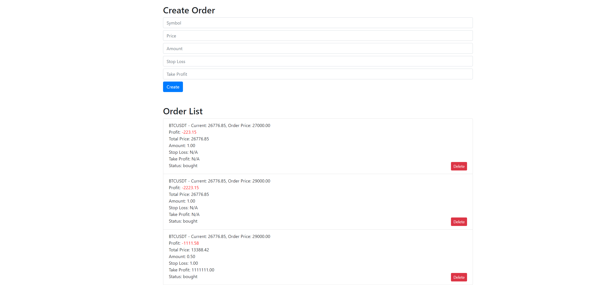

---

# Документація проекту "Binance Order Management System"

## Вступ:

Система "Binance Order Management System" створена для ефективного управління ордерами в реальному часі, використовуючи дані з Binance через WebSocket.

---

## Зміст:

- [Вступ](#вступ)
- [Технічні характеристики](#технічні-характеристики)
- [Запуск тестів](#запуск-тестів)
- [Запуск системи](#запуск-системи)
- [API для роботи з ордерами](#api-для-роботи-з-ордерами)
- [Обгрунтування технічних рішень](#обгрунтування-технічних-рішень)
- [Можливі поліпшення](#можливі-поліпшення)

---

## Технічні характеристики:

- Мова програмування: Python
- Веб-фреймворк: Django
- API фреймворк: Django REST framework
- База даних: SQLite
- Контейнерізація: Docker

---

## Запуск тестів:

Для запуску тестів використовуйте команду:

```
docker-compose run web python manage.py test
```

---

## Запуск системи

### Вимоги:

- Docker
- Docker Compose

### Кроки для запуску:

1. **Збірка Docker образу**:
   
   Перш за все, потрібно зібрати Docker образ для вашого проєкту. Це можна зробити за допомогою команди:
   
   ```bash
   docker build -t binance_order_system .
   ```

2. **Запуск сервісів за допомогою Docker Compose**:

   Щоб запустити всі необхідні сервіси, використовуйте команду:

   ```bash
   docker-compose up -d
   ```

   Опція `-d` означає "detached mode", що дозволяє Docker працювати в фоновому режимі.

3. **Застосування міграцій бази даних**:

   Щоб застосувати міграції бази даних, виконайте команду:

   ```bash
   docker-compose exec web python manage.py migrate
   ```

   Тут `web` - це назва сервісу, який виконує Django за допомогою `docker-compose`. Залежно від вашої конфігурації Docker Compose, назва сервісу може відрізнятися.

4. **Перевірка роботи**:

   Після запуску, система буде доступна за адресою [http://0.0.0.0:8000/](http://0.0.0.0:8000/). Відкрийте цю адресу у вашому веб-браузері, щоб перевірити роботу системи.

   

5. **Зупинка сервісів**:

   Щоб зупинити всі запущені сервіси, використовуйте:

   ```bash
   docker-compose down
   ```

---

## API для роботи з ордерами:

1. **Створення ордера:**

   - **Endpoint:** `/api/orders/`
   - **Method:** `POST`
   - **Параметри:** 
     - `symbol`: Назва криптовалюти (строка)
     - `order_type`: Тип ордера (`BUY` або `SELL`)
     - `price`: Ціна символа (десяткове число)
     - `amount`: Кількість (десяткове число)
     - `stop_loss` (необов'язковий): Ціна стоп-лоса (десяткове число)
     - `take_profit` (необов'язковий): Ціна тейк-профіта (десяткове число)

2. **Отримання списку ордерів:**

   - **Endpoint:** `/api/orders/`
   - **Method:** `GET`

3. **Редагування ордера:**

   - **Endpoint:** `/api/orders/<order_id>/`
   - **Method:** `PUT`
   - **Параметри:** 
     - Такі ж, як і при створенні ордера.

4. **Видалення ордера:**

   - **Endpoint:** `/api/orders/<order_id>/`
   - **Method:** `DELETE`

---

## Обгрунтування технічних рішень:

1. **Використання Django та Django REST framework:**
   
   Django - це високорівневий фреймворк для веб-розробки, який дозволяє швидко створювати надійні та збалансовані за безпекою веб-застосунки. Django REST framework дозволяє легко розробляти API для взаємодії з фронтендом.

2. **Використання WebSocket для взаємодії з Binance API:**

   WebSocket надає можливість отримання даних в реальному часі, що є критично важливим для роботи з криптовалютними ринками, де ціни можуть швидко змінюватися.

3. **Використання Docker:**

   Docker дозволяє ізолювати середовище проекту та гарантує, що він буде працювати однаково на різних машинах. Це полегшує розгортання та масштабування застосунку.

4. **Оптимізація запитів до бази даних:**

   Використовуючи `bulk_update` та `bulk_create`, ми зменшили кількість запитів до бази даних, що підвищує продуктивність системи та зменшує навантаження на сервер.

5. **Використання Decimal для роботи з фінансовими даними:**

   Decimal дозволяє точно обраховувати фінансові дані, уникнути проблем з округленням та забезпечити вірність розрахунків.

6. **Використання SQLite як бази даних:**

   SQLite - це легка, вбудована в Django база даних, яка ідеально підходить для розробки та прототипування. Вона дозволяє швидко розгортати проект без необхідності налаштування зовнішньої бази даних.

7. **Динамічне розширення системи:**

   Завдяки ретельно написаним тестам для API та сокетів, система готова до масштабування та динамічного розширення. Це забезпечує високу надійність та підтримкуваність програмного забезпечення.

---

## Можливі поліпшення:

1. **Підтримка Futures:**

   На даний момент система працює тільки зі спотовими ринками Binance. Є можливість розширити систему для підтримки Futures, що дозволить користувачам працювати з контрактами на майбутнє, використовуючи аналогічний інтерфейс для управління ордерами.

2. **Оптимізація взаємодії з базою даних:**

   При активному надходженні даних можна використовувати кешування або відкладене оновлення для підвищення продуктивності системи.

3. **Додавання аналітичних інструментів:**

   Вбудовані аналітичні інструменти, такі як графіки, історія ордерів і статистика, можуть поліпшити зручність користування.

4. **Підтримка додаткових бірж:**

   Розширення системи для роботи не тільки з Binance, а й з іншими криптовалютними біржами, зробить її більш універсальною та корисною для користувачів.

5. **Взаємодія з реальним API біржі для управління ордерами:**

   Інтеграція системи безпосередньо з API Binance для створення, управління та слідкування за реальними ордерами дозволить користувачам не тільки спостерігати за змінами на ринку в реальному часі, але й активно торгувати без потреби переходити на саму біржу.
